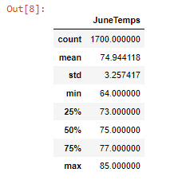

# surfs_up
## Overview of the analysis

  ### An investor named W.Avy wants more information about temperature trends in Oahu,Hawaii,before committing a surf and icecream shop in the same place.
     The purpose of our analysis is to see temperature statistics for June and December to see if running a  shop is sustainable year around.To analyze the weather we      used SQLAlchemy to query the Sqlite database.
     
     
   ## Results
   Please see the  temperature Statistics  for June.
   
   
   
