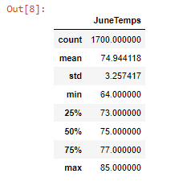
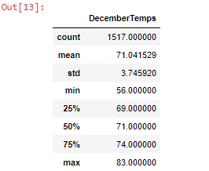

# surfs_up
## Overview of the analysis

  ### An investor named W.Avy wants more information about temperature trends in Oahu,Hawaii,before committing a surf and icecream shop in the same place.
### The purpose of our analysis is to see temperature statistics for June and December to see if running a  shop is sustainable year around in the same place.To analyze the ### weather we used SQLAlchemy to query the Sqlite database.
     

     
  ## Results
   ### Please see the temperature Statistics for June.
   
   
   
   
   ### Please see the temperature Statistics for December.
   
   

### This data gives us a summary of different statistics of  temperature difference in a year. The count is the number of times temperature was observed.The mean difference for June and December is around 3.86(temp+3 or temp-3);and Std deviation of less than 1 =0.49 and the max values are close .

## Summary
 Additional  data which attributes to weather needs to be included to get an overall idea about the weather and how often people visit the place. But as the temperature for two months didn't skewed much,and as per the data which support openeing a shop Oahu, Hawaii. Best Wishes!

    
    
    
   
